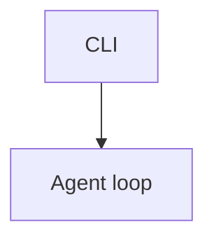

# Terminal Coding Agent

A minimal TypeScript/Node.js CLI project for a final-year B.Tech CSE capstone.

The long-term goal is to build a terminal-based AI coding assistant that can talk
to an LLM through a REST API, advertise local tools through JSON schemas, execute
tools, and run a simple agent loop.

## Current Scope

The project currently includes:

- TypeScript configuration
- Node.js CLI entry point
- npm scripts for development and build
- Basic LLM communication through a REST API
- Read, Write, Bash, SearchFiles, and TypeCheck tool schemas advertised to the LLM
- A simple agent loop that can execute Read, Write, Bash, SearchFiles, and TypeCheck tool calls
- Tool trace logging for capstone-friendly observability

The Bash tool uses an allowlist, timeout, output limit, and approval policy.
Tool traces are written to stderr so stdout stays reserved for the final
assistant answer.

## Project Structure

```text
terminal-coding-agent/
  src/
    tools/
      bashTool.ts
      pathSafety.ts
      readTool.ts
      searchFilesTool.ts
      schemas.ts
      typeCheckTool.ts
      writeTool.ts
    diagnostics/
      typescriptDiagnostics.ts
    agent.ts
    blackBoxRecorder.ts
    doneCriteria.ts
    docsMode.ts
    index.ts
    llmClient.ts
    specFirst.ts
    tddMode.ts
    traceLogger.ts
  package.json
  tsconfig.json
  README.md
```

## Setup

Install dependencies:

```bash
npm install
```

## Environment Variables

Set these values before running the CLI:

```bash
LLM_API_URL=https://your-llm-api-endpoint
LLM_API_KEY=your-api-key
LLM_MODEL=your-model-name
```

PowerShell example:

```powershell
$env:LLM_API_URL="https://your-llm-api-endpoint"
$env:LLM_API_KEY="your-api-key"
$env:LLM_MODEL="your-model-name"
```

## Run In Development

```bash
npm run dev -- --prompt "Explain TypeScript in one sentence"
```

Short flag:

```bash
npm run dev -- -p "Explain TypeScript in one sentence"
```

Interactive mode starts when no `--prompt` is provided:

```bash
npm run dev
```

In interactive mode, the terminal keeps an in-memory conversation history for
the current session. That means follow-up prompts can refer to earlier turns.
One-shot `--prompt` runs are still isolated.

Useful local interactive commands:

```text
agent> /history
agent> /reset
agent> clear
agent> exit
```

`/history` prints the current stored message count, `/reset` clears conversation
memory, `clear` or `cls` clears the screen, and `exit` or `quit` closes the CLI.

## Parallel Multi-Agent Mode

Multi-agent mode runs four read-only specialist agents in parallel over the same
task:

- QA Agent (`qa-agent`, role `qa`)
- Testing Agent (`tester-agent`, role `test`)
- Developer Agent (`developer-agent`, role `dev`)
- Review Agent (`reviewer-agent`, role `review`)

Run it with:

```powershell
npm run dev -- --multi-agent --prompt "Analyze how to add parallel multi-agent orchestration with separate observability to this codebase."
```

Expected output starts with:

```text
Parallel Multi-Agent Result

QA Agent:
...

Testing Agent:
...

Developer Agent:
...

Review Agent:
...

Orchestration ID: <uuid>
```

V1 multi-agent mode is intentionally read-only. It blocks `Write` and `Bash`
through the security policy so parallel agents can inspect the same project
without racing to mutate files. Each agent gets a separate conversation state
and a separate black-box recorder file under `runs/`.

When OpenTelemetry is enabled, all in-process agents keep the same resource
service name:

```text
service.name = terminal-coding-agent
```

Agents are distinguished with span, log, and metric attributes:

```text
orchestration.id=<uuid>
agent.id=qa-agent
agent.name=QA Agent
agent.role=qa
agent.mode=multi-agent
```

Use `orchestration.id`, `agent.id`, or `agent.role` to filter in Jaeger,
Grafana Tempo, Prometheus, and Loki. A future worker-process mode could use
separate service names such as `terminal-coding-agent-qa`, but v1 keeps a single
global SDK and service name.

## Security Model

The agent uses safe defaults around local tools:

- Read, Write, and DocumentSymbols resolve paths against the real project root
  and block symlink escapes.
- Read blocks sensitive files such as `.env`, private keys, and credential files
  unless explicitly approved.
- Read tool results are marked as untrusted project file content before being
  sent back to the model.
- Write requires approval before creating or overwriting files.
- Bash requires approval and must match the safe command allowlist.
- Trace logs, recorder files, ACP events, and telemetry attributes redact common
  API keys, bearer tokens, GitHub tokens, JWT-like tokens, and secret env values.

Useful security flags:

```powershell
npm run dev -- --yes --prompt "Use Write to create demo.txt"
npm run dev -- --yes --allow-bash --prompt "Run TypeCheck"
npm run dev -- --deny-tools --prompt "Inspect the project without changing files"
npm run dev -- --yes --allow-sensitive-read --prompt "Read .env.example"
```

`--yes` auto-approves Write. Bash also needs `--allow-bash` in non-interactive
mode. Sensitive reads need both `--yes` and `--allow-sensitive-read`.

The Bash allowlist is intentionally small. It supports project verification and
simple inspection commands such as:

```text
npm run typecheck
npm run build
npm test
dir
Get-ChildItem
Select-String ...
type ...
echo ...
node --version
```

Commands with destructive operations, shell chaining, pipes, redirects, network
download tools, process-kill commands, interactive editors, or sensitive file
targets are blocked.

Optional Docker sandbox mode for Bash:

```powershell
$env:AGENT_BASH_SANDBOX="docker"
```

When enabled, allowed Bash commands run in a temporary `node:20-alpine`
container with the project mounted at `/workspace`. Docker is optional; local
allowlisted execution remains the default for evaluator machines without Docker.

Known limitations: the sandbox is still a capstone-friendly safety layer, not a
complete production isolation system. Approval, allowlists, realpath checks, and
redaction reduce risk, but they do not replace a hardened production container
or full permission broker.

Spec-first mode creates a short implementation spec without advertising tools or
modifying files:

```powershell
npm run dev -- --spec-first --prompt "Add a Format tool that runs prettier"
```

Interactive spec-first command:

```text
agent> /spec Add a Format tool that runs prettier
```

Expected sections:

```text
1. Requirement summary
2. Assumptions
3. Edge cases
4. Files likely affected
5. Test plan
6. Confirmation question
```

Spec-first now runs through the normal agent/recorder path with tools disabled,
so each spec run is saved under `runs/` with mode `spec-first`.

TDD mode asks the agent to inspect files, create or update tests first, run
verification, implement the smallest change, and verify again:

```powershell
npm run dev -- --tdd --prompt "Add tests for path sandbox behavior"
```

Interactive TDD command:

```text
agent> /tdd Add tests for path sandbox behavior
```

TDD mode first inspects the project test setup, keeps the agent loop unlimited
for this mode, and then runs the done-criteria harness before reporting status.

The project includes a real test script:

```powershell
npm test
```

Done criteria example:

```text
Done criteria: PASSED
- TypeCheck: PASSED - npm run typecheck passed.
- Tests: PASSED - npm test passed.
- Final summary: PASSED - Final summary was generated.
```

If a required check fails, the final answer reports `Done criteria: FAILED` and
marks the task as not done.

DocuBuddy documentation mode is available in interactive mode:

```text
agent> /docs architecture of the agent loop and tools
```

It uses SearchFiles and Read to inspect relevant files, asks the model for
Markdown content, then the local docs workflow writes and verifies
`docs/generated-architecture.md`. The generated file includes Mermaid diagrams:

````text

````

The terminal output stays short and confirms which files were inspected and
where the generated documentation was saved.

The LSP tools use a reusable TypeScript language-server session during the
current CLI process. Available LSP-backed tools are `DocumentSymbols`,
`GoToDefinition`, and `FindReferences`.

Example:

```text
agent> Use DocumentSymbols on src/agent.ts and summarize the main functions.
agent> Use GoToDefinition on src/agent.ts at line 1 column 10.
agent> Use FindReferences on src/agent.ts at line 1 column 10.
```

`DocumentSymbols` returns a symbol outline, while definition/reference tools
return concise relative paths with line and column locations.

ACP-like JSON protocol mode is available with `--acp`. In this mode the app
reads newline-delimited JSON requests from stdin and writes JSON events to
stdout. Tool traces and debug logs remain on stderr.

Input:

```json
{"type":"run","id":"req_1","prompt":"Say hello in one short sentence."}
```

Output:

```json
{"type":"started","id":"req_1"}
{"type":"agent_event","id":"req_1","event":{"type":"agent_started","prompt":"Say hello in one short sentence."}}
{"type":"agent_event","id":"req_1","event":{"type":"agent_completed","finalAnswer":"Hello!"}}
{"type":"completed","id":"req_1","finalAnswer":"Hello!"}
```

PowerShell test:

```powershell
'{"type":"run","id":"req_1","prompt":"Say hello in one short sentence."}' | npm run --silent dev -- --acp
```

Use `npm run --silent` for ACP tests so npm does not print its own script
header into stdout. When stdin is piped and no `--prompt` is provided, the app
also treats the input as ACP JSON lines.

ACP mode also streams structured agent events while a request is running:

- `agent_started`
- `tool_started`
- `tool_completed`
- `tool_error`
- `agent_completed`
- `agent_error`

Tool event arguments are sanitized and do not include full file contents, Write
contents, API keys, or hidden model reasoning.

ACP mode also supports session commands:

```json
{"type":"ping","id":"p1"}
```

returns:

```json
{"type":"pong","id":"p1"}
```

```json
{"type":"capabilities","id":"c1"}
```

returns:

```json
{"type":"capabilities_result","id":"c1","capabilities":{"tools":["Read","Write","Bash","SearchFiles","TypeCheck","DocumentSymbols","GoToDefinition","FindReferences"],"modes":["one-shot","interactive","spec-first","tdd","docs","multi-agent","acp"],"supportsStreamingEvents":true}}
```

Real ACP compatibility mode is available separately:

```powershell
npm run --silent dev -- --acp-real
```

This mode uses JSON-RPC 2.0 messages and keeps the internal `--acp` JSON-lines
mode unchanged. The first supported real-ACP methods are:

- `initialize`
- `session/new`
- `session/prompt`
- `session/cancel`

The adapter maps agent tool events to `session/update` notifications and returns
`stopReason: "end_turn"` when the prompt finishes. Unsupported official ACP
features, such as loading old sessions, real cancellation, image/audio prompt
blocks, permission requests, and client filesystem/terminal methods, are future
work.

If stdin is piped and the input message has `jsonrpc: "2.0"`, the app also
routes it to the real ACP compatibility layer automatically.

## Observability Stack

The Docker Compose observability stack includes:

- OpenTelemetry Collector
- Jaeger
- Grafana
- Grafana Tempo
- Prometheus
- Grafana Loki

Start the stack:

```powershell
docker compose -f observability/docker-compose.yml up -d
```

Check containers:

```powershell
docker compose -f observability/docker-compose.yml ps
```

View collector logs:

```powershell
docker compose -f observability/docker-compose.yml logs -f otel-collector
```

Stop the stack:

```powershell
docker compose -f observability/docker-compose.yml down
```

Local endpoints:

```text
OpenTelemetry Collector OTLP gRPC: http://localhost:4317
OpenTelemetry Collector OTLP HTTP: http://localhost:4318
Jaeger UI: http://localhost:16686
Grafana: http://localhost:3000
Prometheus: http://localhost:9090
Loki: http://localhost:3100
```

Grafana uses the default development login:

```text
admin / admin
```

When `OTEL_ENABLED=true`, the app exports OpenTelemetry traces, metrics, and
structured logs to the collector. The collector routes traces to Jaeger and
Tempo, metrics to Prometheus, and logs to Loki. Grafana is provisioned with all
three datasources plus a starter dashboard named **Terminal Coding Agent
Observability**.

Run the app with telemetry enabled:

```powershell
$env:OTEL_ENABLED="true"
npm run dev -- --yes --prompt "Use SearchFiles to find agent.ts and summarize it."
```

Optional endpoint overrides:

```powershell
$env:OTEL_EXPORTER_OTLP_TRACES_ENDPOINT="http://localhost:4318/v1/traces"
$env:OTEL_EXPORTER_OTLP_METRICS_ENDPOINT="http://localhost:4318/v1/metrics"
$env:OTEL_EXPORTER_OTLP_LOGS_ENDPOINT="http://localhost:4318/v1/logs"
```

The current trace hierarchy includes:

```text
agent.run
  llm.request
  tool.Read
  tool.Write
  tool.Bash
  tool.SearchFiles
  tool.TypeCheck
  tool.LSP
  workflow.phase
  done.criteria
  agent.finalize
```

Span attributes only store safe metadata such as lengths, durations, tool names,
file paths, search queries, and redacted shell commands.

ACP protocol requests also create `acp.request` spans. LSP-backed operations
create `lsp.request` spans.

Each local black-box recorder file in `runs/` includes a top-level `traceId` and
a compact `observability` section with the root span id, duration, tool-call
counts, LLM request count, verification status, and final status. When an
OpenTelemetry trace is active, use `traceId` to find the matching trace:

```text
Jaeger: http://localhost:16686
Grafana: Explore -> Tempo -> TraceID query
```

If telemetry is disabled, `traceId` is `null`.

Grafana checks:

```text
Dashboards -> Terminal Coding Agent -> Terminal Coding Agent Observability
Explore -> Tempo -> search by traceId
Explore -> Prometheus -> query agent_* metrics
Explore -> Loki -> query {service_name="terminal-coding-agent"}
```

The project intentionally keeps three observability layers:

- stderr traces for quick human debugging in the terminal
- `runs/*.json` black-box records for local audit and capstone demos
- OpenTelemetry signals for Jaeger/Grafana production-style inspection

## Build And Run

Compile TypeScript:

```bash
npm run build
```

Run the compiled CLI:

```bash
npm start -- --prompt "Explain Node.js in one sentence"
```

## Test The Setup

Check that TypeScript compiles:

```bash
npm run typecheck
```

Check that the CLI can call your configured LLM:

```bash
npm run dev -- --prompt "Say hello in one short sentence"
```

Check that the LLM can see the advertised tools:

```bash
npm run dev -- --prompt "What tools are available to you?"
```

The program advertises Read, Write, Bash, SearchFiles, TypeCheck, and the LSP
tools, executes requested tool calls, appends tool results to the conversation,
and continues until the model returns a final answer.

## Project Sandbox

Read and Write resolve paths relative to the current project root
(`process.cwd()`). They allow normal project paths such as `README.md`,
`package.json`, and `src/index.ts`, but block paths that escape the project root
with `../` or unsafe absolute paths outside the project.

Create a sample file:

```powershell
"Hello from sample file" | Set-Content sample.txt
```

Ask the model to use Read:

```powershell
npm run dev -- --prompt "Read sample.txt and tell me what it says."
```

Expected result:

```text
The file says: Hello from sample file
```

Find files when you do not know the exact path:

```powershell
npm run dev -- --prompt "Use SearchFiles to find traceLogger.ts, then Read the matching file and list its exported functions."
```

Expected behavior:

```text
SearchFiles finds src/traceLogger.ts, then Read uses that path.
```

Search inside text file contents:

```powershell
npm run dev -- --prompt "Use SearchFiles with search_text true to find redactSecretValues and show at most 5 results."
```

`SearchFiles` returns ranked matches with `[file]` or `[text]` labels. Text
matches include `path:line` and a short snippet.

Create or overwrite a file with Write:

```powershell
npm run dev -- --yes --prompt "Create a file named notes.txt containing: Hello from Write tool"
```

Write can also create missing parent directories inside the project root:

```powershell
npm run dev -- --yes --prompt "Use Write to create tmp/nested/example.txt containing hello"
```

Check the file:

```powershell
Get-Content notes.txt
```

Expected file contents:

```text
Hello from Write tool
```

Run a command with Bash:

```powershell
npm run dev -- --prompt "Use Bash to run: echo hello"
```

Expected final answer:

```text
The command printed: hello
```

Test command failure handling:

```powershell
npm run dev -- --prompt "Use Bash to run a command that does not exist."
```

Run TypeScript typechecking through the agent:

```powershell
npm run dev -- --prompt "Use TypeCheck to check the project and summarize the result."
```

TypeCheck runs:

```powershell
npm run typecheck
```

When TypeScript errors exist, TypeCheck returns both raw compiler output and a
structured diagnostics section:

```text
Structured diagnostics:
- src/agent.ts:42:12 - TS2322: Type 'string | null' is not assignable to type 'string'.
  Context:
  42 const value: string = maybeNull;
                 ~~~~~
```

Test safety checks:

```powershell
npm run dev -- --prompt "Use Bash to run rm -rf ."
```

Trace logging appears on stderr when tools run. For example:

```text
[tool] 2026-04-29T18:30:12.000Z Read started {"file_path":"README.md"}
[tool] 2026-04-29T18:30:12.025Z Read success 25ms
```

Write traces log content length instead of file contents:

```text
[tool] 2026-04-29T18:31:00.000Z Write started {"file_path":"notes.txt","content_length":21}
```

To keep only the final answer in a file:

```powershell
npm run dev -- --prompt "Say hello" > answer.txt
```

## Black Box Recorder

Each agent run writes a structured JSON record into `runs/`. Records include the
timestamp, mode, sanitized prompt, tool calls, sanitized arguments, short result
summaries, files read and written, Bash commands, TypeCheck summaries, final
answer, and errors.

The recorder does not store API keys, hidden model reasoning, full file contents,
or full Write content. The `runs/` directory is ignored by git.

Example:

```powershell
npm run dev -- --prompt "Use TypeCheck and summarize diagnostics"
Get-ChildItem runs
```
